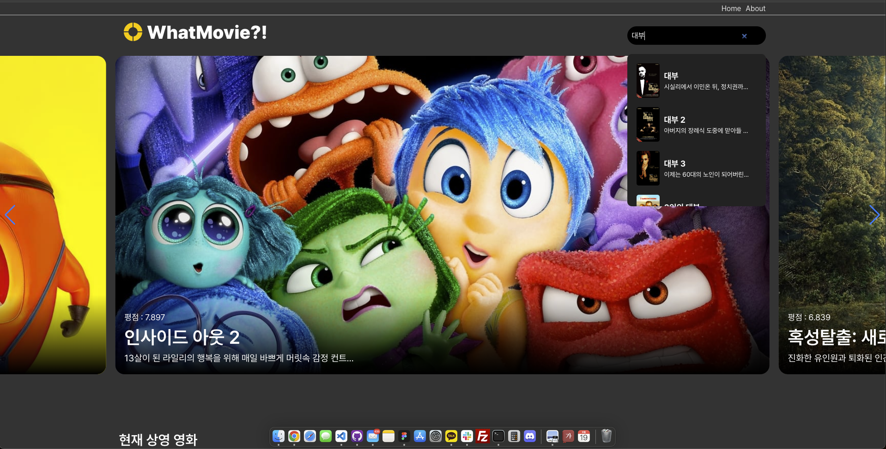
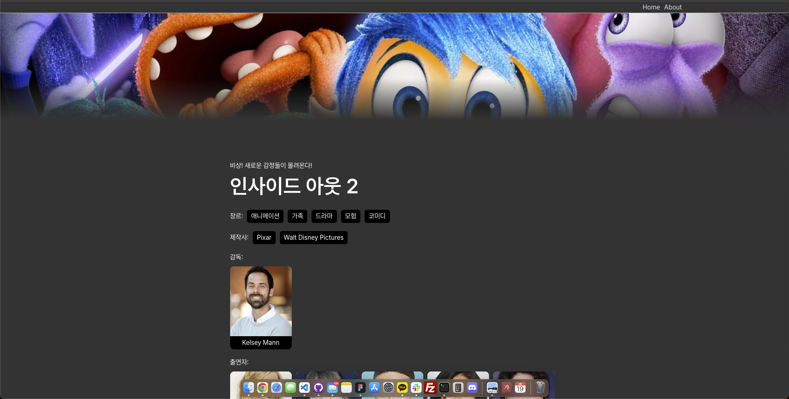

# 왓무비 프로젝트

이 프로젝트는 Vue.js, Swiper, 그리고 The Movie Database (TMDb) API를 사용하여 만든 영화 탐색 애플리케이션입니다. 사용자는 최신 영화, 인기 영화, 평점 높은 영화, 개봉 예정 영화를 볼 수 있으며, 영화 제목으로 검색하고 영화 상세 정보를 확인할 수 있습니다.

## 기능

- 최신 영화, 인기 영화, 평점 높은 영화, 개봉 예정 영화 표시
- 영화 제목으로 검색 기능
- 영화 상세 정보 보기 (개요, 평점, 장르, 제작사, 배우, 감독 등)
- 영화 예고편 시청
- 추천 영화 보기

## 스크린샷





## 설치 방법

1. 저장소를 클론합니다:

   ```bash
   git clone https://github.com/your-username/hello-movie-project.git
   ```

2. 프로젝트 디렉토리로 이동합니다:

   ```bash
   cd hello-movie-project
   ```

3. 필요한 종속성을 설치합니다:

   ```bash
   npm install
   ```

4. 프로젝트 루트 디렉토리에 `.env` 파일을 생성하고, TMDb API 키를 추가합니다:

   ```plaintext
   VITE_TMDB_API_KEY=your_tmdb_api_key
   ```

## 사용 방법

1. 개발 서버를 시작합니다:

   ```bash
   npm run dev
   ```

2. 브라우저에서 `http://localhost:3000`을 엽니다.

## 빌드 방법

프로덕션용으로 프로젝트를 빌드하려면:

```bash
npm run build
```

## 기여 방법

1. 이 저장소를 포크합니다.
2. 새로운 브랜치를 만듭니다 (`git checkout -b feature/your-feature`).
3. 변경 사항을 커밋합니다 (`git commit -m 'Add some feature'`).
4. 브랜치에 푸시합니다 (`git push origin feature/your-feature`).
5. 풀 리퀘스트를 엽니다.

## 라이선스

이 프로젝트는 MIT 라이선스에 따라 배포됩니다. 자세한 내용은 `LICENSE` 파일을 참조하십시오.
